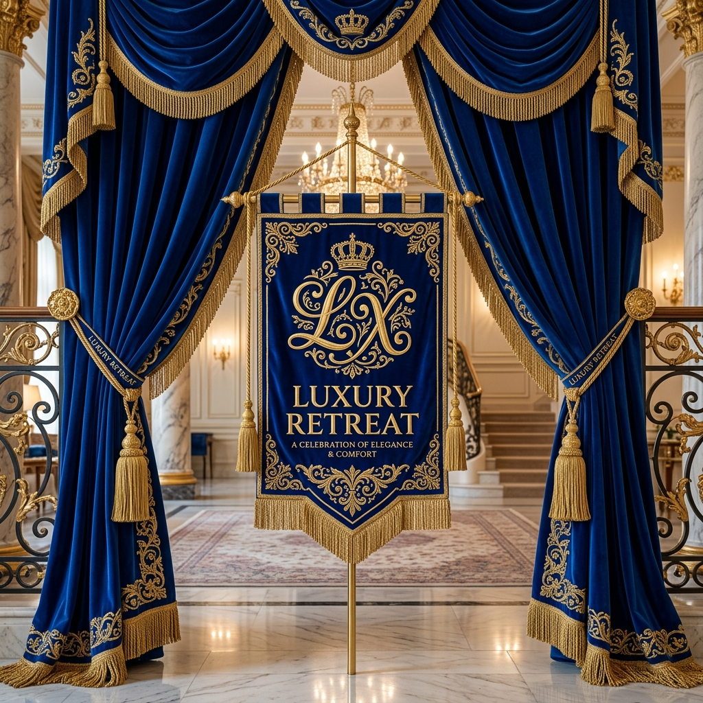
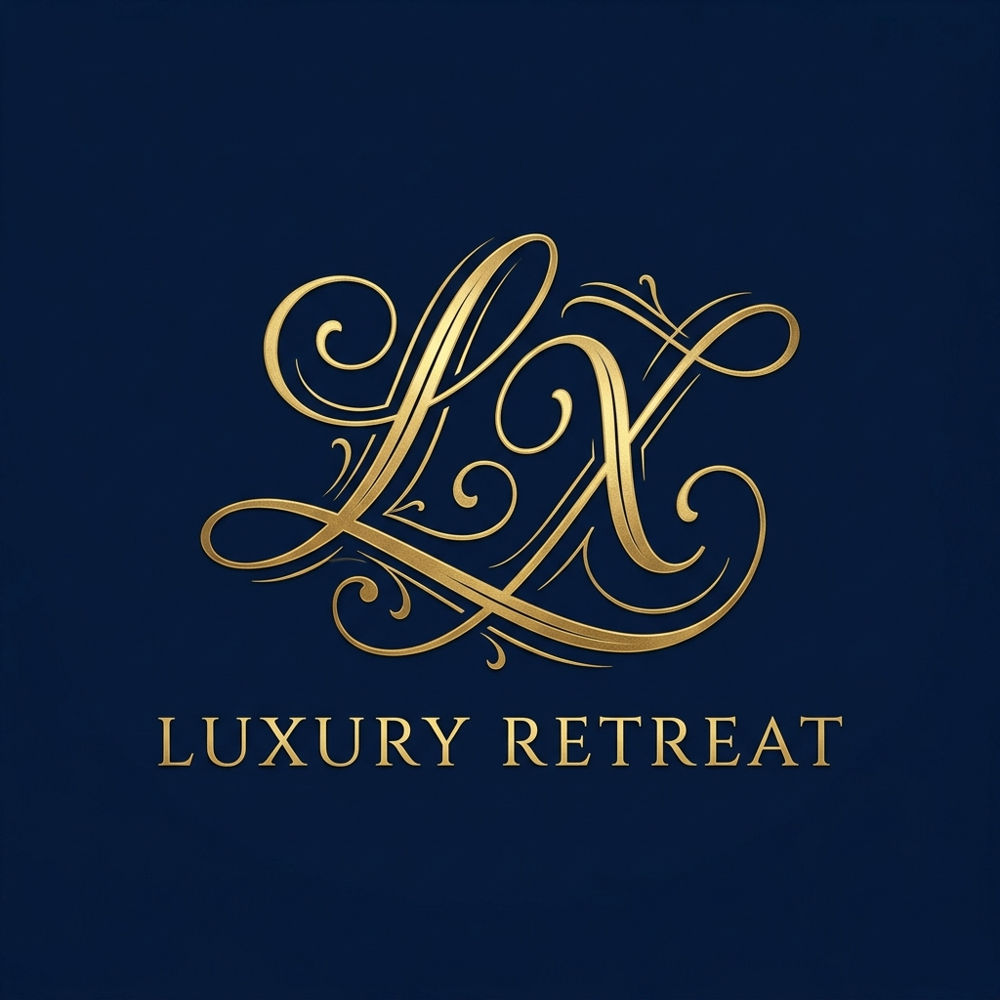

<p align="center">
  
</p>

<p align="center">
  
</p>

<h1 align="center">👑 LUXURY RETREAT 👑</h1>
<p align="center">
  <strong>The Most Ultra-Luxury Experiential Resorts & Reservation Platform in India</strong>
</p>

<p align="center">
  <a href="https://luxury-retreat.onrender.com" target="_blank">
    
  </a>
</p>

<p align="center">
  
  
  
  
</p>

---

## 🔱 Welcome to the Realm of Royalty

**Luxury Retreat** is an experiential, 7-star hotel reservation system modeled after the ultra-exclusive **Della Resorts** aesthetic. Built with a robust **Java Spring Boot** backend and a cinematic, responsive **React.js & Tailwind CSS** frontend, the platform replicates the high-end hospitality features, extreme adventure booking, theme gastronomy, and wellness spa offerings.

Every visual element has been tailored to evoke a sense of nobility, transitioning from traditional slate themes into a deep, premium **Royal Navy Blue** and **Chamber Gold** aesthetic.

---

## 🎨 Visual Identity & Royal Design System

```
  ⚜️  Base Canvas        :  Deep Royal Navy Blue (#06122c)
  ⚜️  Grid & Card Panels :  Dark Navy Blue (#0c1b3d)
  ⚜️  Modals & Overlays  :  Midnight Blue (#050d21) with soft opacities
  ⚜️  Primary Accent     :  Gleaming Gold (#bda371) / Antique Gold (#a68a5c)
```

*   **Parted Royal Curtains**: Parted visual curtains define the framing elements of the workspace.
*   **Video-Overlay Navigation Menu**: The header menu sits transparently over a looping widescreen YouTube hero video, blending to a semi-transparent royal navy backdrop (`rgba(6, 18, 44, 0.95)`) upon scroll.
*   **Cursive Monogram**: Features a gold "LX" monogram badge integrated into the header, footer, and active AI chat concierge panels.
*   **Zoom-on-Hover Staggered Grids**: Visual highlights of stay packages and extreme activities.

---

## 🚀 Royal Features & Capabilities

### 🛏️ Stay Chamber Reservation Grid
*   **6 Signature Resorts**: Supports interactive bookings for *Garden Villa*, *Luxury Resort*, *Camp Luxury Retreat Tents*, *Adventure Resort*, *Enclave Villas*, and the *DATA Military Escape*.
*   **Availability Status check**: Live updates on rates, room capacity, and check-in options.

### 🍽️ Gastronomy Selection
*   **8 Theme Restaurants & Bars**: Details for Café 24, Villa Bistro, Parsi Dhaba, PNF, Crème Luxury Retreat, Sports Bar, Salaam Manekshaw, and Sky Garden.
*   **Interactive Table Booking**: Custom booking modals to schedule date, timing, and guest count.

### 🧗 Extreme Adventure Park
*   **Staggered 6-Photo Layout**: Replicates Della's extreme sports panels.
*   **50+ Activities**: Supports detail bookings for Swoop Swings (100 ft), Ziplines (1250 ft), and Zorbing.

### 💳 Stripe Checkout & Stepper Wizard
*   **3-Step Stepper Flow**: Guides guests through dates selection, premium perks (breakfast, shuttle, spa access), credentials input, and Stripe card payment validation.
*   **Flipping Stripe Card UI**: A micro-animated payment card that flips dynamically to show CVV verification.
*   **QR-Coded Check-in Receipt**: Generates a printer-optimized invoice layout hiding browser frames.

### 🍷 RAG AI Concierge
*   **AI Chatbot Widget**: A floating RAG-based concierge to answer resort-related queries.
*   **RAG Similarity Engine**: Backed by a keyword/TF-IDF similarity index running in Java to fetch contextual resort knowledge documents.
*   **Simulated Trace Logs**: View active RAG agent DAG routing paths directly from the developer console.

---

## 🛠️ Technology Stack

*   **Backend Core**: Java 17, Spring Boot 3.x, Spring Data JPA, Hibernate, H2 Database.
*   **RAG Engine**: Natural Language Similarity Index, TF-IDF Search Matchers.
*   **Frontend Core**: React 18, Tailwind CSS, Babel Compiler, custom CSS/SVG transitions.
*   **Payment Gateway Integration**: Custom Stripe Card Payment mock interface.

---

## 💻 How to Install & Run Locally

### Prerequisites
Make sure you have **Java 17** (or higher) installed on your system.

### Step 1: Clone the Repository
```bash
git clone https://github.com/Arpi-tect/Luxury.git
cd Luxury
```

### Step 2: Run the Spring Boot Server
Launch the application using the Maven wrapper:
*   **Windows (PowerShell/CMD)**:
    ```cmd
    .\mvnw.cmd spring-boot:run
    ```
*   **Linux / macOS**:
    ```bash
    chmod +x mvnw
    ./mvnw spring-boot:run
    ```

The server will spin up on port **`8082`**.

### Step 3: Experience the Royalty
Open your browser and navigate to:
👉 **[http://localhost:8082](http://localhost:8082)**

---

## 📁 Repository Structure

```text
Luxury/
├── pom.xml                     # Maven build dependencies
├── README.md                   # Royal Documentation
├── data/                       # Local database file storage
└── src/
    └── main/
        ├── java/com/apex/hotelreservation/
        │   ├── HotelReservationSystemApplication.java  # Main execution
        │   ├── model/                  # JPA Database Entities
        │   ├── repository/             # Database access layers
        │   ├── service/                # Business services & RAG NLP
        │   └── controller/             # REST API Controllers
        └── resources/
            ├── application.properties               # System configurations (Port 8082)
            └── static/
                ├── index.html                       # Core React Client
                ├── luxury_retreat_logo.png          # LX Monogram logo
                ├── luxury_retreat_banner.png        # Royal curtain banner
                └── real_gold_curtain.png            # Visual curtain asset
```

---

<p align="center">
  ⚜️ <b>Luxury Retreat</b> — Where hospitality meets imperial design. Powered by Spring Boot and React. ⚜️
</p>
